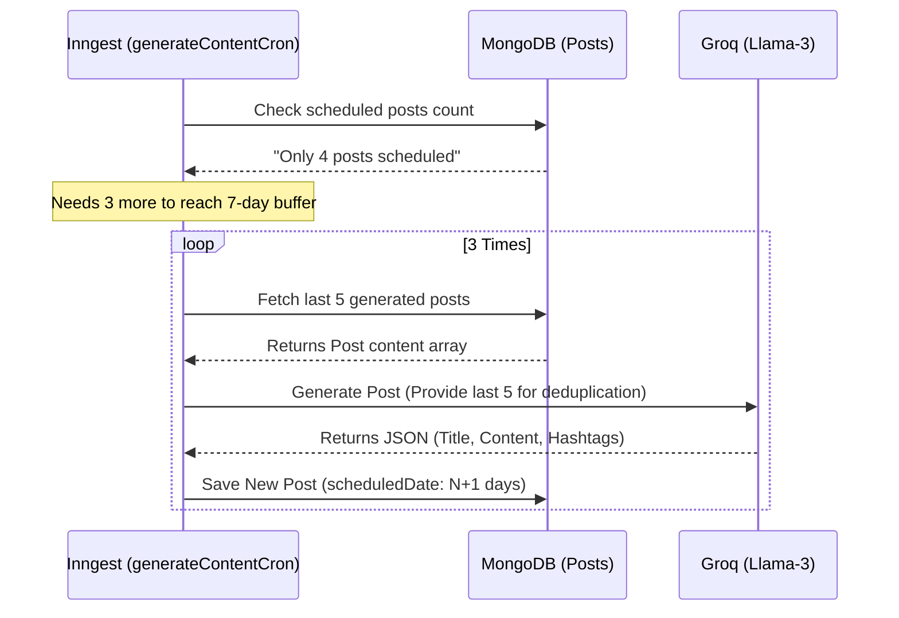

# Content Generation Flow

This document details how the infinite content calendar sustains a 7-day buffer of unique GMB posts.

## Sequence Diagram

## Description
This cron job acts as a proactive maintenance worker. The critical step is the deduplication logic. By querying the database for the 5 most recent posts and passing them into the LLM's system prompt context window, we mathematically instruct the AI to explore different topics, preventing the "calendar fatigue" common in AI automation tools.
