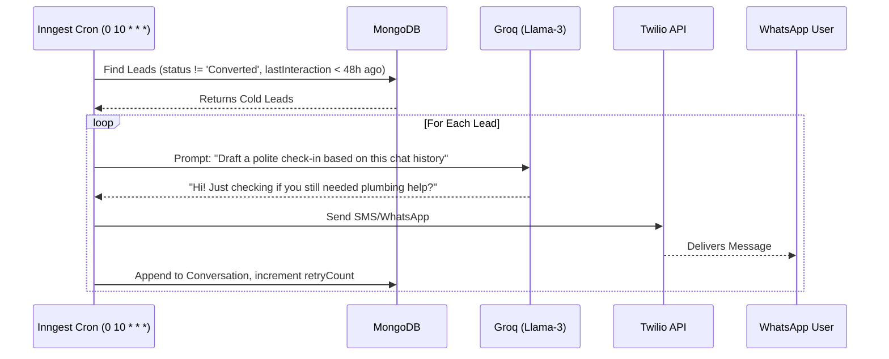

# Lead Follow-Up Flow

This document details how the CRM automatically schedules and executes follow-up messages for leads that go cold.

## Sequence Diagram

## Description
The follow-up cron runs daily. It isolates users who haven't responded within a specific timeframe (usually 48 hours). Instead of sending a generic "Are you still there?" template, it passes the user's specific `aiSummary` and `Conversation` array to the LLM to draft a highly contextual, personalized check-in.
