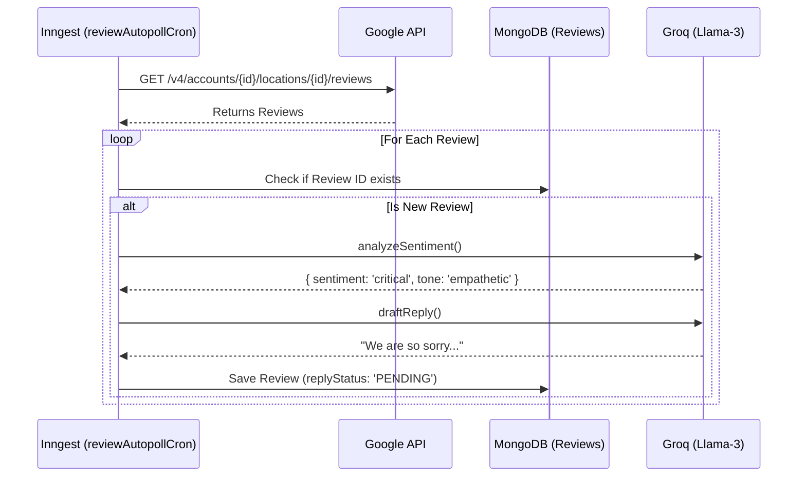

# Review Monitoring Flow

This details how the system polls for new reviews and automatically drafts AI replies.

## Sequence Diagram

## Description
The auto-poll runs continuously in the background. By comparing the fetched Google reviews against the `Review` database, it identifies newly posted reviews. It then executes two sequential AI calls: one rigid call for classification (sentiment) and one creative call for drafting the response.
