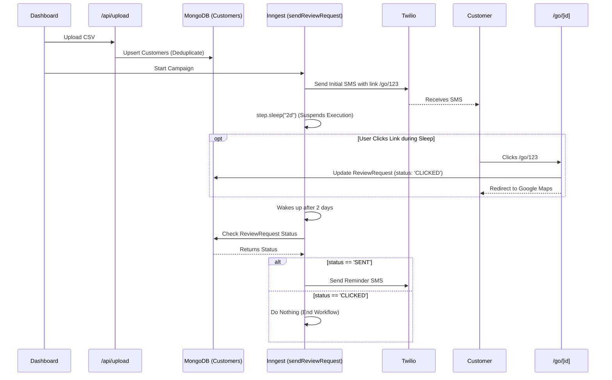

# Review Request Drip Campaign Flow

This flow illustrates the delayed execution capabilities of Inngest for managing SMS review campaigns over multiple days.

## Sequence Diagram

## Description
The review generation campaign relies on Inngest's `step.sleep()` function to pause the worker in the cloud without consuming server resources. When it awakens, it queries the database to see if the smart-link interceptor (`/go/[id]`) logged a click. If the user clicked, they are spared the reminder text.
