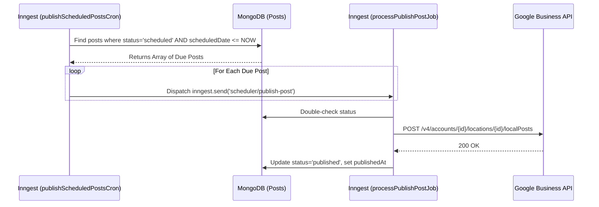

# Post Publishing Scheduler Flow

This outlines how approved/scheduled content is pushed live.

## Sequence Diagram

## Description
Instead of one massive loop executing API calls (which could crash and leave half the posts unpublished), the primary Cron simply acts as a dispatcher. It finds *all* due posts, and fans them out to individual `processPublishPostJob` workers. This ensures that if publishing one post fails due to a Google API error, it isolates the failure and retries that specific post without affecting the others.
