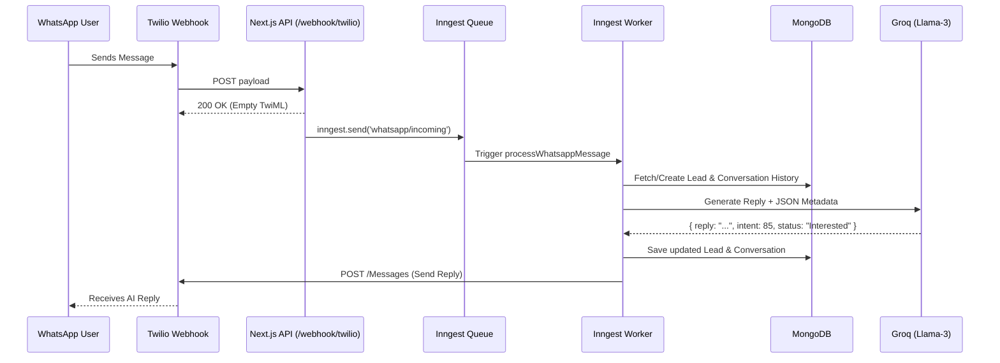

# WhatsApp AI Flow

This document outlines the asynchronous architecture of handling an incoming WhatsApp message via Twilio, routing it through Groq AI, and responding.

## Sequence Diagram

## Description
To avoid Twilio's strict 15-second timeout, the system decouples ingestion from processing. The LLM inference (which can take 2-8 seconds depending on context size) runs entirely in the background via Inngest, ensuring robust retries if Groq rate-limits are hit.
